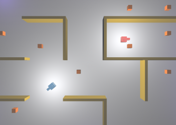

# Enshrined

Created for the 2020 Global Game Jam.
Enshrined is a 2-player game where you compete to repair your own shrines before the opponent can repair theirs.
The code is a mess. Nothing has any structure. I made this under a time limit. Please don't look at the source :).
Made from scratch using Java/OpenGL in 2 days.
Requires 64-bit Java 1.8+.

GGJ submission: https://globalgamejam.org/2020/games/enshrined-1
